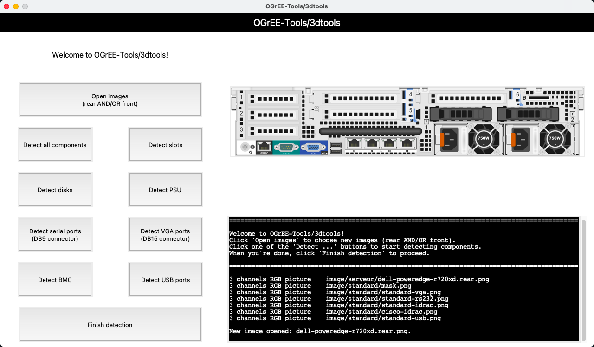

# 3dtools user guide

This is a user guide for 'OGrEE-Tools/3dtools', a powerful program that can automatically locate components on an image of a server and output a JSON with their coordinates in mm. This output can be used to generate a bidimensional model of the face of the server. These bidimensional models of the back and front faces of a server can be combined to form a tridimensional model.

## Components supported

| Name | method |
| ------ | ------ |
| BMC interface | YOLOv8 object detection |
| USB port | YOLOv8 object detection |
| VGA port | YOLOv8 object detection |
| Serial port | YOLOv8 object detection |
| Slot normal | YOLOv8 object detection |
| Slot lp | YOLOv8 object detection |
| Disk lff | YOLOv8 object detection |
| Disk sff | YOLOv8 object detection |
| PSU | YOLOv8 object detection |

## Requirements

The minimum Python version required to use 3dtools is Python version 3.6.

Package infomation in [requirements.txt](requirements.txt)

## Setup

To use `OGrEE-Tools/3dtools`, run the following commands to clone the repository and install the dependencies:

```sh
git clone https://github.com/ditrit/OGrEE-Tools.git
cd OGrEE-Tools/3dtools
pip3 install -r ./requirements.txt
```

## Introduction

### main.py
This is the general pilot of all the functions, and also the CLI.
Here is a minimum tutorial example.

```sh
cd /.../OGrEE-Tools/3dtools
python3 main.py --servername image/serveur/dell-poweredge-r720xd.rear.png --height 86.8 --length 482.4
```

Some basic parameters should be given as arguments.

> 
    --servername : string, the file name of image;
    --height : float, horizontal dimension (in mm);
    --length : float, vertical dimension (in mm);
    --face : string, 'front' or 'rear'.
>

You can also just run the *main.py* in python consoler. In this case, a default server "dell-poweredge-r720xd.rear.png" will be shown.

```sh
cd /.../OGrEE-Tools/3dtools
python3 main.py
```

Run `python3 main.py --gui` to interact with the Graphic User Interface (GUI).



You can also set aditional parameters to control the algorithm's performance.

> 
    # YOLOv8 hyparameters
    --model : string, model path or triton URL, if you don't want to change the YOLOv8 model, don't use it;
    --conf : float, default=0.5, confidence threshold, YOLOv8 will filter the results below it;
    --iou : float, default=0.45, 'NMS IoU threshold';
    --device : default=cuda device, i.e. 0 or 0,1,2,3 or cpu;
    --augment : if provided, augmented inference;
    --show : if provided, show results on screen;
    --save : if provided, save detection results;
    --save-txt : if provided, save results to *.txt;
    --save-conf : if provided, save confidences in --save-txt labels;
    --save-crop : if provided, save cropped prediction boxes;
    --show-labels : if provided, show labels;
    --show-conf : if provided, show confidences;
    --show-boxes : if provided, show bounding boxes;
    --line-width : bounding box line width (pixels).
>

### Running the CLI

#### 1. Use the following code to start the program.

```sh
cd /.../OGrEE-Tools/3dtools
python3 main.py --servername image/serveur/dell-poweredge-r720xd.rear.png --height 86.8 --width 482.4 --face rear
```

#### 2. Select components for detection

The user will be prompted with the following message:

```sh
Choose a component to detect.
Available commands: 'All', 'BMC', 'Disk_lff', 'Disk_sff', 'Disks', 'PSU', 'Serial', 'Slot_lp', 'Slot_normal', 'Slots', 'USB', 'VGA'
Enter 'finish' to output the JSON.

Command = ...
```

Enter the wished component name to start detecting.

Examples:

```sh
> BMC
> VGA
> Serial
> Slots
```
Results are printed, showing all detected components in the format `xxx in [x, y, angle, similarity]`.

```sh
Detecting VGA...
  - VGA in : [[640.0, 860.0, 0.0, 0.7698690075499673]]
```

**Attention:** the type of input code is *string*. If we want transform it into a interface connect with other program, the command should also be *string*, not int.

#### 3. Finish and output

After detecting all components, type in `finish` to start the output processing.

```sh
finish
```

The program will generate the JSON file and save it under folder `/.../OGrEE-Tools/3dtools/api` with the server name + '.json'. It will show:

```sh
{(16, 92): ('vga', 0.0, 0.8375591957768449), (16, 59): ('rs232', 0, 0.8667459425301842), ...}
dell-poweredge-r720xd  json file in "/api/"
```

The json file is written in the following format:

```json
[
    {
        "location": "vga0",
        "type": "vga",
        "elemOrient": "horizontal",
        "elemPos": [
            92.0,
            0,
            9.0
        ],
        "elemSize": [
            16.0,
            11.0,
            8.0
        ],
        "labelPos": "rear",
        "color": "",
        "attributes": {
            "factor": "",
            "similarity": 0.7698690075499673,
        }
    }
    ...
]
```

## Test example results

### JSON file

The JSON file of test example dell-poweredge-r720xd.rear should be similar to [test.json](api/test.json) if components 11, 12, 13, 14 and 15 are detected.

### 3d model

Original photo:


3D model:


# Description of a standard server (components):

## Standard image/components

We chose model *ibm-x3690x5.rear.png* as the standard server. This image has a ratio of 9.14x pixel/mm. 

Standard idrac, rs232, vga and usb components were captured and saved at path `/.../OGrEE-Tools/3dtools/image/standard/`.

**Note:**: vga and rs232 components in IBM devices have slightly larger holes than other manufacturers.

Another idrac template was captured from model *cisco-c240-m6-lff.rear.png*, and is used for Cisco models.

**Note:** idrac components in Cisco devices have a different shape from other manufacturers (the pins are shorter).

## Classifiers in *Classifier* class:

### dl_addComponents:

This classifier is designed to find all components using the foreign YOLOv8 method for detection.

The user can detct all components at once by typing command `All`. These components can also be detected individually.

| Command | Components detected |
| ------ | ------ |
| All | Slot normal, Slot lp, Disk sff, Disk lff, psu |
| BMC | BMC |
| Disks |  Disk lff, Disk sff |
| Disk_sff | Disk sff |
| Disk_lff | Disk lff |
| Slots | Slot normal, Slot lp |
| Slot_lp | Slot lp |
| Slot_normal | Slot normal |
| PSU | PSU |
| Serial | Serial |
| USB | USB |
| VGA | VGA |

#### Notes:

- The unit dimension of power supply units differ among manufacturers. A data base has to be created to account for this information;

- A spreadsheet with the shapes of servers is stored under `/.../OGrEE-Tools/3dtools/image/name_list.xlsx`. Use with caution, as some data might be incorrect;

- A very common error is to inverse the x and y axis, because the indexes in different libraries are not the same; some use (vertical, horizontal), while others use (horizontal, vertical). For the further programming, check the axis order when the classifier finds a component at the wrong position but with high similarity, or when the component position is out of the picture. The user can trust that the present version works properly.

- In 3dtools code, the origin point is situated on the top left corner of the picture; in the JSON file, the 3D origin point is situated on the back bottom right corner of the model.
