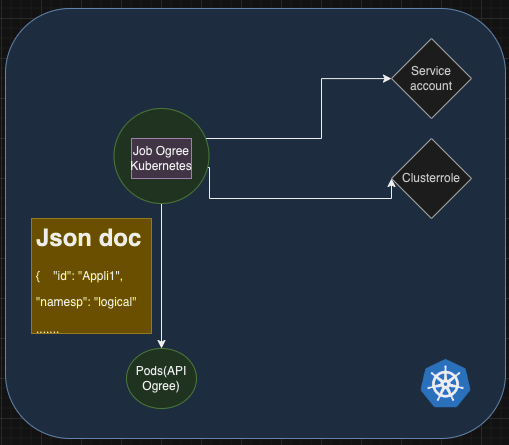

# Ogree Kube
## _Creation storage class, nfs type_

1- install NFS server on your host
2- configure exports
3-restart NFS server
4-Install provisionner with Helm chart
```sh
$ helm repo add nfs-subdir-external-provisioner https://kubernetes-sigs.github.io/nfs-subdir-external-provisioner/
$ helm install nfs-subdir-external-provisioner nfs-subdir-external-provisioner/nfs-subdir-external-provisioner \
    --set nfs.server=x.x.x.x \
    --set nfs.path=/exported/path
```
### _Example creation of pods using nfs storage_
1-create storage class
```sh
apiVersion: storage.k8s.io/v1
kind: StorageClass
metadata:
  name: nfs-client
provisioner: k8s-sigs.io/nfs-subdir-external-provisioner 
parameters:
  archiveOnDelete: "false"
```
2-create PVC

```sh
kind: PersistentVolumeClaim
apiVersion: v1
metadata:
  name: test-claim
spec:
  storageClassName: nfs-client
  accessModes:
    - ReadWriteMany
  resources:
    requests:
      storage: <>
```

3-create pod manifest adn deploy (example of pods deployments)
```sh
kind: Pod
apiVersion: v1
metadata:
  name: test-pod
spec:
  containers:
  - name: test-pod
    image: busybox:stable
    command:
      - "/bin/sh"
    args:
      - "-c"
      - "touch /mnt/SUCCESS && exit 0 || exit 1"
    volumeMounts:
      - name: nfs-pvc
        mountPath: "/mnt"
  restartPolicy: "Never"
  volumes:
    - name: nfs-pvc
      persistentVolumeClaim:
        claimName: test-claim
```
## _Add request limit for Qos_

Kubernetes defines requests as a guaranteed minimum amount of a resource to be used by a container.

Basically, it will set the minimum amount of the resource for the container to consume.

When a Pod is scheduled, kube-scheduler will check the Kubernetes requests in order to allocate it to a particular Node that can satisfy at least that amount for all containers in the Pod. If the requested amount is higher than the available resource, the Pod will not be scheduled and remain in Pending status.
```sh
resources:
   requests:
        cpu: <>
        memory: <>
```
Kubernetes defines limits as a maximum amount of a resource to be used by a container.

This means that the container can never consume more than the memory amount or CPU amount indicated.
```sh
resources:
    limits:
        cpu: <>
        memory: <>
```
## _Change directory in containerd to use another disk for pods sckeduling_

`$ mkdir <repository>`

`$ sudo blkid`
```
/dev/sdb15: SEC_TYPE="msdos" UUID="46CD-A675" BLOCK_SIZE="512" TYPE="vfat" PARTUUID="eafa22fb-179f-5443-912c-b5d354179af8"
/dev/sdb1: UUID="b2-4cf5-b4f3-446b1fab152a" BLOCK_SIZE="4096" TYPE="ext4" PARTUUID="69d095c0-750b-d34b-979b-2743de9285e7"
/dev/sr0: BLOCK_SIZE="2048" UUID="2024-02-03-13-46-49-00" LABEL="cidata" TYPE="iso9660"
/dev/sda1: UUID="ec5-499a-888b-50fc09279a60" BLOCK_SIZE="4096" TYPE="ext4" PARTUUID="cd0eab23-01"
/dev/sdb14: PARTUUID="4a798518-5b83-7444-ae85-1fc79b4d7390"
```
select UUID and put in the file /etc/fstab

Example of /etc/fstab file

```
UUID=b203b121-43d5-4cf5-b4f3-446b1fab152a / ext4 rw,discard,errors=remount-ro,x-systemd.growfs 0 1
UUID=46CD-A675 /boot/efi vfat defaults 0 0
UUID=<> /mnt/kube2 ext4 defaults,errors=remount-ro 0 1
```
`$ sudo mount -a`

`$ sudo mkfs.ext4 /dev/sda1`

`$ systemctl daemon-reload`

Modify /etc/containerd/config.toml file
```
root = "<repository>"
state = "<repository>"
```
`$ systemctl restart containerd.service`

## _Oggre S3 buckets seaweedfs_

The Container Storage Interface (CSI) is a standard for exposing arbitrary block and file storage systems to containerized workloads on Container Orchestration Systems (COs) like Kubernetes.
This can dynamically allocate buckets and mount them via a fuse mount into any container.

For this, we used Seaweedfs buckets as buckets kubernetes to store volume.
```sh
git clone https://github.com/ctrox/csi-s3.git
```
and follow instructions and requirements to install CSI seaweeds fs
```sh
apiVersion: v1
kind: Secret
metadata:
  namespace: kube-system
  name: csi-s3-secret
  # Namespace depends on the configuration in the storageclass.yaml
  namespace: kube-system
stringData:
  accessKeyID: <YOUR_ACCESS_KEY_ID>
  secretAccessKey: <YOUR_SECRET_ACCES_KEY>
  # For AWS set it to "https://s3.<region>.amazonaws.com"
  endpoint: <S3_ENDPOINT_URL>
  # If not on S3, set it to ""
  region: <S3_REGION>
```
Example of pods using buckets S3 for storage

```sh
apiVersion: v1
kind: PersistentVolumeClaim
metadata:
  name: csi-s3-pvc
  namespace: default
spec:
  accessModes:
  - ReadWriteMany
  resources:
    requests:
      storage: 1Gi
  storageClassName: csi-s3

```
```sh
kind: StorageClass
apiVersion: storage.k8s.io/v1
metadata:
  name: csi-s3
provisioner: ru.yandex.s3.csi
parameters:
  mounter: geesefs
  # you can set mount options here, for example limit memory cache size (recommended)
  options: "--memory-limit 1000 --dir-mode 0777 --file-mode 0666"
  # to use an existing bucket, specify it here:
  bucket: ogree
  csi.storage.k8s.io/provisioner-secret-name: csi-s3-secret
  csi.storage.k8s.io/provisioner-secret-namespace: kube-system
  csi.storage.k8s.io/controller-publish-secret-name: csi-s3-secret
  csi.storage.k8s.io/controller-publish-secret-namespace: kube-system
  csi.storage.k8s.io/node-stage-secret-name: csi-s3-secret
  csi.storage.k8s.io/node-stage-secret-namespace: kube-system
  csi.storage.k8s.io/node-publish-secret-name: csi-s3-secret
  csi.storage.k8s.io/node-publish-secret-namespace: kube-system
```
```sh
apiVersion: v1
kind: Pod
metadata:
  name: csi-s3-test-nginx
  namespace: default
spec:
  containers:
   - name: csi-s3-test-nginx
     image: nginx
     volumeMounts:
       - mountPath: /usr/share/nginx/html/s3
         name: webroot
  volumes:
   - name: webroot
     persistentVolumeClaim:
       claimName: csi-s3-pvc
       readOnly: false
```
## _Oggre kubernetes architecture_




This architecture is the basic architecture without the use of plugins to capture a kubernetes cluster.
Basically, it enables links between different kubernetes resources to be passed to the Ogree API in the following formats:
```json

{

    "nodes": [
        "nodes-infos"
    ],
    "namecluster": "cluster-test",
    "resources": [
        {
            "namespace": "default",
            "type": "deployments",
            "name": "example1",
            "ressources": [
                {
                    "type": "pod",
                    "name": "example-rcjdb",
                    "resources": [
                        {
                            "pvc": "test-pvc",
                            "resources": [
                                {
                                    "pv-type": "nfs",
                                    "pv-path": "/opt/media",
                                    "pv-ip": "X.X.X.X"
                                }
                            ]
                        }
                    ]
                }
            ]
        }
```
An example above

To run this script go to the repository [script-nososreport](script-nososreport) and run the script.
#### Requirements: Kubectl and jq already install on your machine
## with sos report plugin
sos report is a plugin for capturing all machine information. With the kubernetes plugin, the script formats the output of sos report and transforms it into ogree format.
To access it, go to the [script-sosreport](script-sosreport)  directory and run the script as follows:


```sh
python3 vizualisation.py <input_file.json> <output_file.json>
```
input_file.json: sos report file