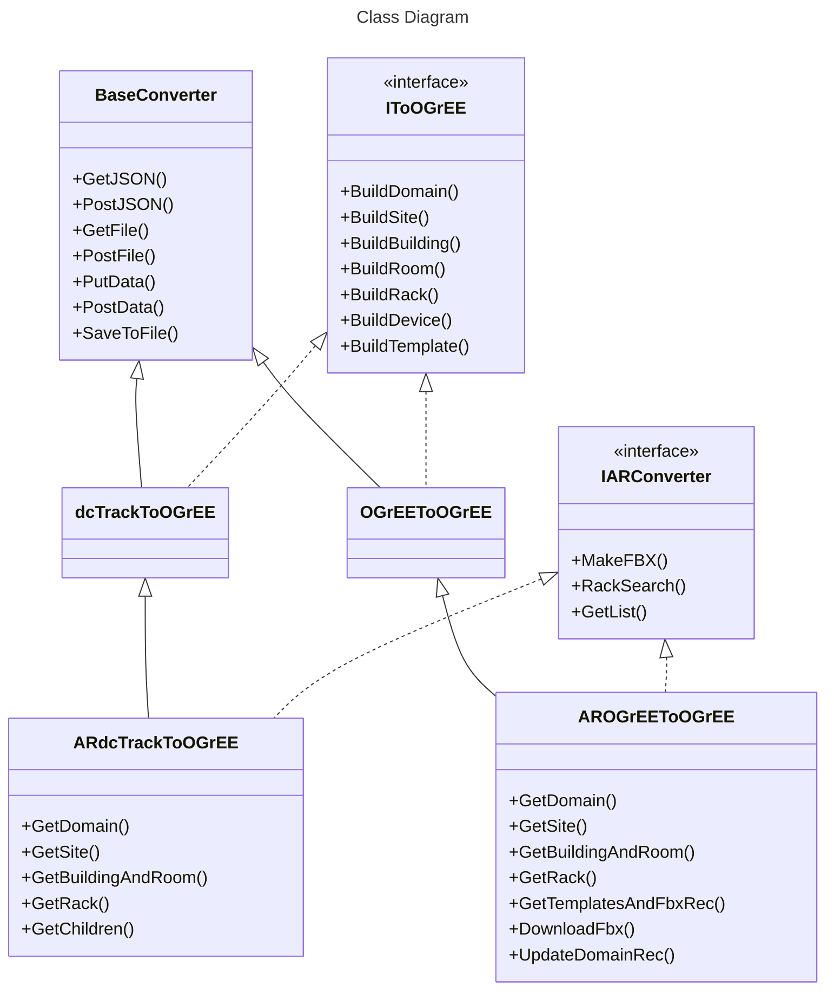

```mermaid
---
title: Class Diagram
---
classDiagram
    BaseConverter <|-- dcTrackToOGrEE
    BaseConverter <|-- OGrEEToOGrEE
    IToOGrEE <|.. dcTrackToOGrEE
    IToOGrEE <|.. OGrEEToOGrEE
    dcTrackToOGrEE <|-- ARdcTrackToOGrEE
    OGrEEToOGrEE <|-- AROGrEEToOGrEE
    IARConverter <|.. ARdcTrackToOGrEE
    IARConverter <|.. AROGrEEToOGrEE
    class BaseConverter{
      +GetJSON()
      +PostJSON()
      +GetFile()
      +PostFile()
      +PutData()
      +PostData()
      +SaveToFile()
    }
    class dcTrackToOGrEE{
    }
    class OGrEEToOGrEE{
    }
    class IToOGrEE {    
      +BuildDomain()
      +BuildSite()
      +BuildBuilding()
      +BuildRoom()
      +BuildRack()
      +BuildDevice()
      +BuildTemplate()
    }
    <<interface>> IToOGrEE
  
    class ARdcTrackToOGrEE{
      +GetDomain()
      +GetSite()
      +GetBuildingAndRoom()
      +GetRack()
      +GetChildren()
    }
    class AROGrEEToOGrEE{
      +GetDomain()
      +GetSite()
      +GetBuildingAndRoom()
      +GetRack()
      +GetTemplatesAndFbxRec()
      +DownloadFbx()
      +UpdateDomainRec()
    }
    class IARConverter{
      +MakeFBX()
      +RackSearch()
      +GetList()
    }
    <<interface>> IARConverter
```
