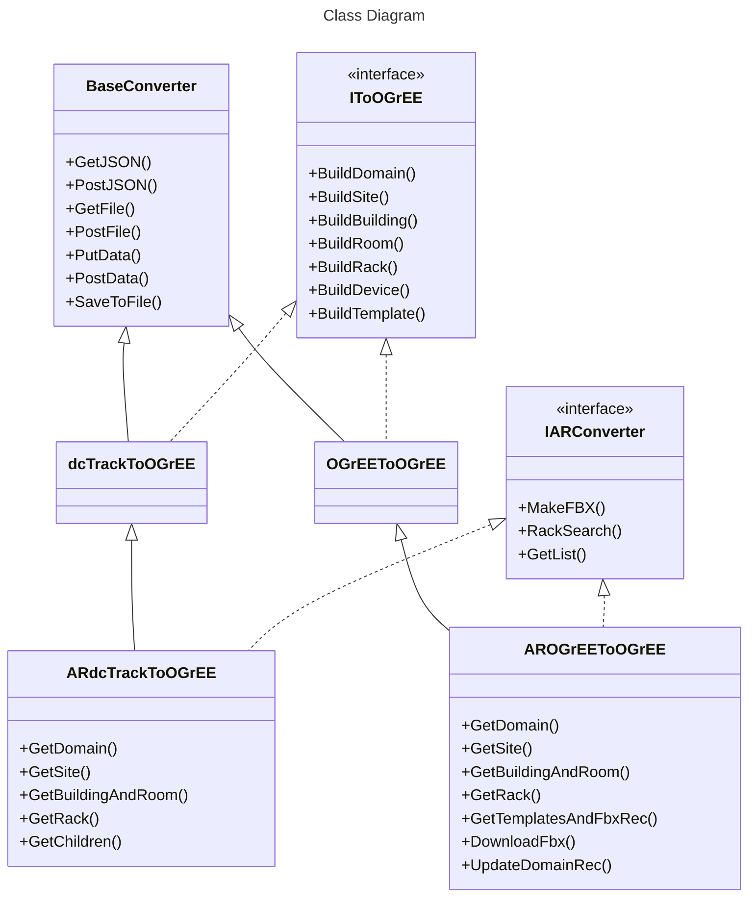

# Set up

For each tool, there is a `setup` folder. Run `python setup.py`

:warning: **${\color{red}Check \space the \space ReadMe \space of \space each \space script \space to \space know \space wich \space python \space version \space to \space use.}$** 

Each setup script will create or modify a [virtual environment](https://docs.python.org/3/library/venv.html), located in `/.venv/`. The setup script will also activate the virtual environment after completion. To deactivate it, type `deactivate`. To reactivate it after, type `./.venv/Script/activate` for Windows or `./.venv/bin/activate` for Linux in the root of the repository.

When executing python script in the virtual environment, only use `python`, not `python3` or `python3.10` to be sure to use the environment python.
# Converter

Converter between dcTrack, Netbox and OGrEE.

[Check the ReadMe for more details.](Converter/README.md)
## Architecture (with [AR](#ar))


## FbxBuilder

Part of the Converter tool, build a FBX file containing a box mesh from its dimension and up to six faces.

Set it up with the same setup script as the Converter tool.

[The file is here.](/Converter/source/fbx/FbxBuilder.py)

### Usage

```console
python FbxBuilder.py [-h] --WDH WDH [--name NAME] [--front FRONT] [--back BACK] [--left LEFT] [--right RIGHT] [--top TOP] [--bottom BOTTOM] [--picFolder PICFOLDER] [-o O]
```

### Options

   Arguments              | Description
  ------------------------|---------------------------    
  `-h`, `--help`          | show this help message and exit
  `--WDH WDH`             | width,depth,height (mm)
  `--name NAME`           | name of the fbx
  `--front FRONT`         | path to the front picture
  `--back BACK`           | path to the back picture
  `--left LEFT`           | path to the left picture
  `--right RIGHT`         | path to the right picture
  `--top TOP`             | path to the top picture
  `--bottom BOTTOM`       | path to the bottom picture
  `--picFolder PICFOLDER` | path to a folder containing pictures ending in -front,-back,...
  `-o O`                  | output path

# NonSquareRooms

Generate the tiles of a non convex room for OGrEE (all unit are in meter)

## Usage

```console
python GenTiles.py [-h] --json JSON [--out OUT] [--angle ANGLE] [--offset OFFSET] [--draw] [--opti] [--tileSize TILESIZE]
```

### Options

   Arguments            | Description
  ----------------------|---------------------------    
  `-h`, `--help`        | show this help message and exit
  `--json JSON`         | path of the room JSON
  `--out OUT`           | name of the returned JSON
  `--angle ANGLE`       | tiling's angle (0 by default) (degree)
  `--offset OFFSET`     | first tile's offset from the first vertex : x,y (m)
  `--draw`              | if you want python to draw the room with numpy
  `--opti`              | if you want python iterate through multiple angles and start positions to get the best tiling (SLOW)
  `--tileSize TILESIZE` | size of a tile (60cm by default) (m)

# AR

Python server for the AR version of OGrEE-3D, reads a rack label from a picture using OCR, performs requests to an OGrEE or dcTrack database and uses the Converter tool to send the rack data back to the AR client.

[Check the ReadMe for more details.](AR/README.md)

## Usage

```console
python AR/source/Server.py [-h] [--verbose {INFO,WARNING,ERROR,DEBUG}] [--debug]
```

### Options

   Arguments                            | Description
  --------------------------------------|---------------------------    
  `-h`, `--help`                        | show this help message and exit
  `--verbose {INFO,WARNING,ERROR,DEBUG}`| Specify the verbose level
  `--debug`                             | Specify a room and rack name with [ROOM].[RACK] format
