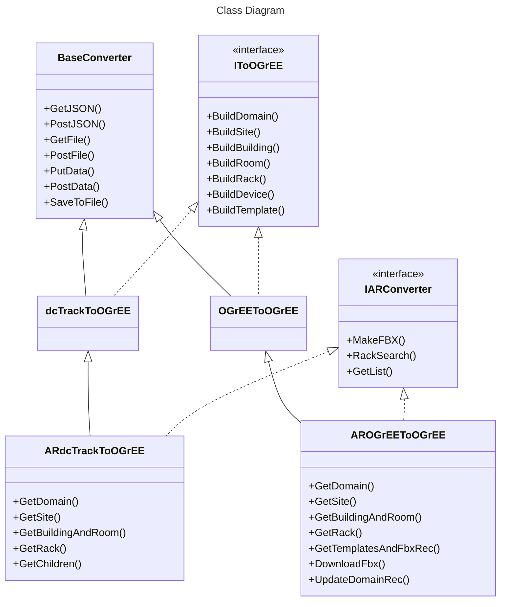

# Converter

## Architecture (with [AR](#ar))


## [FbxBuilder](/Converter/source/fbx/FbxBuilder.py)

Build a FBX file containing a box mesh from its dimension and up to six faces

### Usage

```console
python FbxBuilder.py [-h] --WDH WDH [--name NAME] [--front FRONT] [--back BACK] [--left LEFT] [--right RIGHT] [--top TOP] [--bottom BOTTOM] [--picFolder PICFOLDER] [-o O]
```

### Options

   Arguments              | Description
  ------------------------|---------------------------    
  `-h`, `--help`          | show this help message and exit
  `--WDH WDH`             | width,depth,height (cm)
  `--name NAME`           | name of the fbx
  `--front FRONT`         | path to the front picture
  `--back BACK`           | path to the back picture
  `--left LEFT`           | path to the left picture
  `--right RIGHT`         | path to the right picture
  `--top TOP`             | path to the top picture
  `--bottom BOTTOM`       | path to the bottom picture
  `--picFolder PICFOLDER` | path to a folder containing pictures ending in -front,-back,...
  `-o O`                  | output path

# NonSquareRooms

Generate the tiles of a non convex room for OGrEE (all unit are in meter)

## Usage

```console
python GenTiles.py [-h] --json JSON [--out OUT] [--angle ANGLE] [--offset OFFSET] [--draw] [--opti] [--tileSize TILESIZE]
```

### Options

   Arguments            | Description
  ----------------------|---------------------------    
  `-h`, `--help`        | show this help message and exit
  `--json JSON`         | path of the room JSON
  `--out OUT`           | name of the returned JSON
  `--angle ANGLE`       | tiling's angle (0 by default) (degree)
  `--offset OFFSET`     | first tile's offset from the first vertex : x,y (m)
  `--draw`              | if you want python to draw the room with numpy
  `--opti`              | if you want python iterate through multiple angles and start positions to get the best tiling (SLOW)
  `--tileSize TILESIZE` | size of a tile (60cm by default) (m)

# AR

